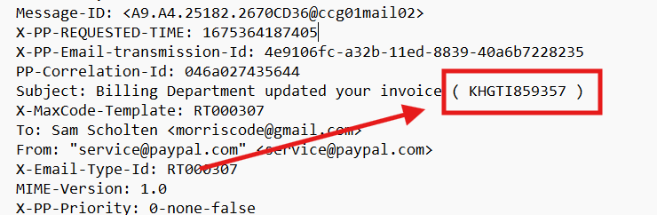

# CTF Challenge – Email Analysis 05

**File:** [email05.eml](./email05.eml)\
**Category:** PayPal Invoice / Header Forensics / URL and Timestamp Analysis

## Questions


1. **Client IP Address**\
   Which IP address appears in the `Received-SPF` header as the client?\
   *Answer format:* IPv4 address

2. **Invoice ID Extraction**\
   What is the invoice identifier embedded in the `Subject:` header?\
   *Answer format:* alphanumeric invoice ID


3. **Epoch Timestamp**\
   The header `X-PP-REQUESTED-TIME` contains a millisecond timestamp. Convert it to a UTC date and time (YYYY-MM-DD HH\:MM\:SS).\
   *Answer format:* UTC datetime

4. **PayPal Button Link Host and Path**\
   In the HTML body, find the “View and Pay Invoice” button URL. Extract the hostname and the path (up to but not including the query string).\
   *Answer format:* hostname/path


5. **DKIM Selector**\
   From the `DKIM-Signature` header, what selector was used to sign the message?\
   *Answer format:* selector name

6. **Quoted-Printable Character**\
   In the body text under “Amount due,” identify the HTML entity or encoding used to represent the non-breaking space between the amount and currency.\
   *Answer format:* the entity or escape code

---

## Writeup and Solutions

### Q1: Client IP Address

- **Where to look:** The `Received-SPF` header near the top.
- **Excerpt:**
  ```
  Received-SPF: pass ... designates 66.211.170.86 as permitted sender
  ```
- **Answer:**
  ```
  66.211.170.86
  ```

  

### Q2: Invoice ID Extraction

- **Where to look:** The `Subject:` header line.
- **Header:**
  ```
  Subject: Billing Department updated your invoice ( KHGTI859357 )
  ```
- **Answer:**
  ```
  KHGTI859357
  ```

  


### Q3: Epoch Timestamp

- **Where to look:** The `X-PP-REQUESTED-TIME` header.
- **Header:**
  ```
  X-PP-REQUESTED-TIME: 1675364187405
  ```
- **Conversion:**
  - 1675364187405 ms = 2023-02-02 18:56:27 UTC
- **Answer:**
  ```
  2023-02-02 18:49:47
  ```

  


### Q4: PayPal Button Link Host and Path

- **Where to look:** In the HTML body `<a>` tag for “View and Pay Invoice.”
- **Excerpt:**
  ```html
  <a href="https://www.paypal.com/invoice/payerView/details/INV2-W6CN-46ZA-BRQ4-HC9U?...">
  ```
- **Extracted:**
  ```
  www.paypal.com/invoice/payerView/details/INV2-W6CN-46ZA-BRQ4-HC9U
  ```

  


>Ignore the 3D's

### Q5: DKIM Selector

- **Where to look:** The `DKIM-Signature` header.
- **Excerpt:**
  ```
  DKIM-Signature: ... s=pp-dkim1 ...
  ```
- **Answer:**
  ```
  pp-dkim1
  ```

  


### Q6: Quoted-Printable Character

- **Where to look:** The HTML body near the amount line.
- **Excerpt:**
  ```html
  Amount due: $479.00=C2=A0USD
  ```
- **Encoding:**\
  `=C2=A0` represents a non-breaking space.
- **Answer:**
  ```
  =C2=A0
  ```

  

