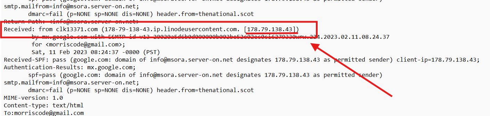

# CTF Challenge – Email Analysis 07

**File:** [email07.eml](./email07.eml)\
**Category:** Phishing / HTML Obfuscation / Link Forensics

## Questions


1. **Sender IP Address**\
   From the `Received:` header, what IPv4 address is listed for the connecting client?\
   *Answer format:* IPv4 address


2. **Link Host Extraction**\
   The HTML body contains a link to a Cloud Storage URL. What is the hostname of that link?\
   *Answer format:* hostname only

3. **Unsubscribe Parameter**\
   In the unsubscribe URL at the bottom, there is a fragment identifier. What is that code?\
   *Answer format:* alphanumeric code after the hash


---

## Writeup and Solutions

### Q1: Sender IP Address

- **Where to look:** The `Received:` header in the message.
- **Excerpt:**
```
  Received: from clk13371.com (178-79-138-43.ip.linodeusercontent.com. [178.79.138.43])
```
- **Answer:**
```
178.79.138.43
```



### Q2: Link Host Extraction

- **Where to look:** The HTML `<a>` tag’s `href` attribute for the main prize link.  
- **Excerpt:**
```html
<a href='http://storage.googleapis.com/...'>
```

- **Answer:**
```
storage.googleapis.com
```


### Q3: Unsubscribe Parameter

- **Where to look:** The unsubscribe link at the bottom of the email.  
- **Excerpt:**
```html
<a href='...#2537313Mj6763378Gg520434352Qg14664pj24HIunsub171571XE'>
```

- **Answer:**
```
2537313Mj6763378Gg520434352Qg14664pj24HIunsub171571XE
```


