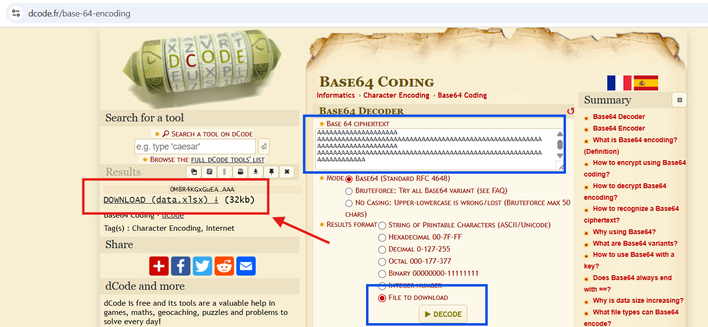
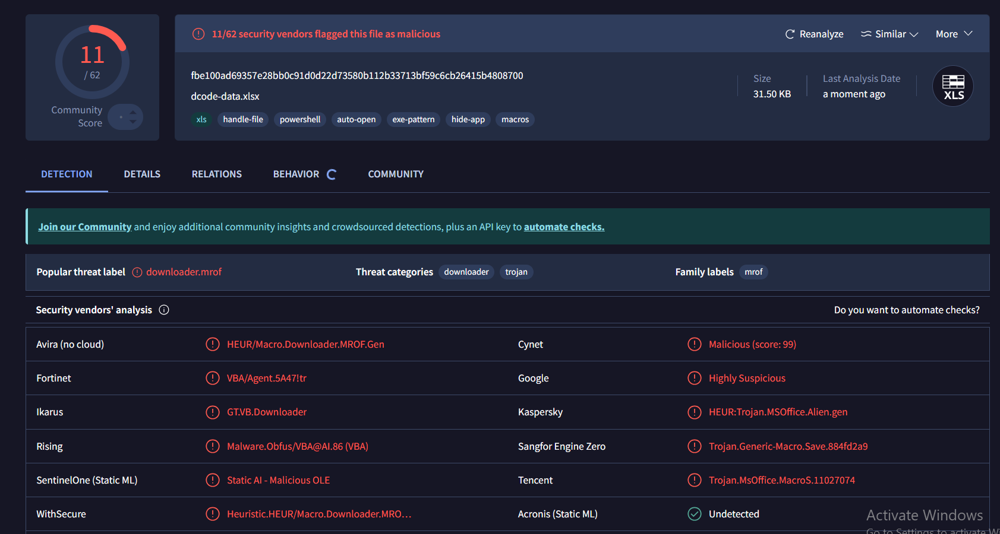
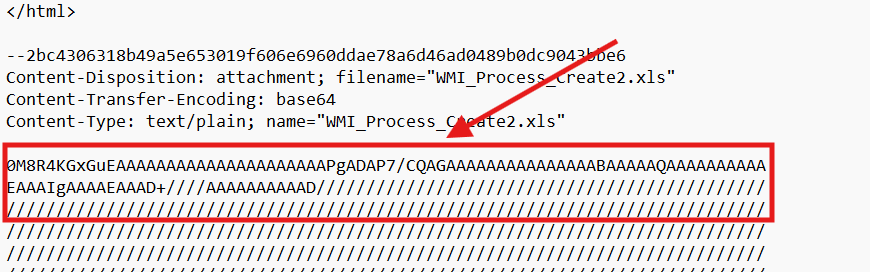
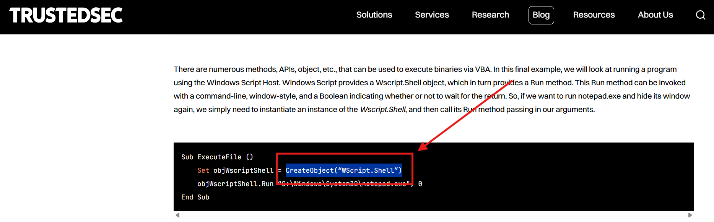

# CTF Challenge – Email Analysis 08

**File:** [email08.eml](./email08.eml)\
**Category:** Suspicious Attachment / Header Forensics / Email Threat Intelligence

## Questions


1. **Excel Version Metadata**\
   What version of Excel generated the attached `.xls` file? Look for metadata strings.\
   *Answer format:* product/version string

2. **Email Client Used**\
   Which platform or email client was used to send the message?\
   *Answer format:* client or platform name


3. **Attachment Filename**\
   What is the exact filename of the attachment?\
   *Answer format:* filename with extension

4. **Attachment File Type Indicator**\
   Based on the base64 header or file content, what is the file format?\
   *Answer format:* common name 

5. **VBA Behavior**\
    What technique allows VBA macros to execute system-level commands using WMI in older Excel documents?\
    *Answer format:* technique or object/method name

---

## Writeup and Solutions

### Q1: Excel Version Metadata

- **Where to look:** Decode the base64 content of the attachment.



After generating the file, upload it to [exif.tools](https://exif.tools/) and there will be the answer!


- **Answer:**
  ```
  Microsoft Excel 2003 Worksheet
  ```

>[!WARNING]
>
>Be careful, the .xlsx file contains actual malware!




### Q2: Email Client Used

- **Where to look:** Headers such as `Received` or source domain/IP behavior.
- **Observation:** Sent via SendGrid (`sendgrid.net`).
- **Answer:**
  ```
  sendgrid.net
  ```


### Q3: Attachment Filename

- **Where to look:** `Content-Disposition` header in MIME part.
- **Excerpt:**
  ```
  Content-Disposition: attachment; filename="WMI_Process_Create2.xls"
  ```
- **Answer:**
  ```
  WMI_Process_Create2.xls
  ```


### Q4: Attachment File Type Indicator

- **Where to look:** First bytes of base64-decoded content.
- **Excerpt:**
  ```
  0M8R4KGxGuEAAAAAAAAAAAAAAAAAAAAAPgADAP7/CQAG...
  ```
- **Interpretation:** This is the header of a legacy Microsoft Office document (OLE2 format).
- **Answer:**
  ```
  Excel spreadsheet
  ```




### Q5: VBA Behavior

- **Where to look:** Google it (Common VBA macro behaviors or WMI automation in Excel-based malware.)
- **References:** Lookup objects like `GetObject("winmgmts:")` or `CreateObject("WScript.Shell")` in macro malware analysis.
- **Answer:**
  ```
  CreateObject("WScript.Shell")
  ```

  https://trustedsec.com/blog/malicious-macros-for-script-kiddies

 



