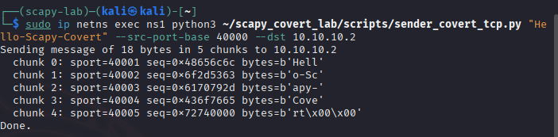
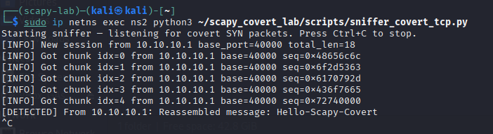
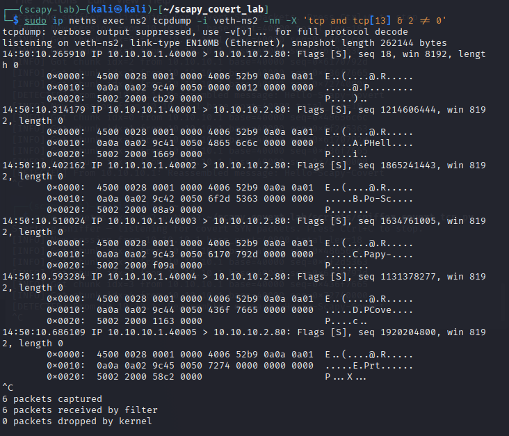

# Lab Solution: Covert TCP Channel

This document contains the solution for the Scapy Covert TCP Channel lab. It includes two ready-to-run Python scripts ([sniffer_covert_tcp.py](./sniffer_covert_tcp.py) and [sender_covert_tcp.py](./sender_covert_tcp.py)) and explanations, sample outputs, verification tips, and cleanup instructions.

---

## 1) `sniffer_covert_tcp.py` — sensor / decoder

Save as `~/scapy_covert_lab/scripts/sniffer_covert_tcp.py` and make executable.

- Also available here: [sniffer_covert_tcp.py](./sniffer_covert_tcp.py)

```python
#!/usr/bin/env python3
"""
sniffer_covert_tcp.py — sniff SYN packets and reconstruct the covert message.

Run inside ns2 as root:
  sudo ip netns exec ns2 python3 sniffer_covert_tcp.py

Protocol (recap):
- The first SYN from a sender uses src port == src_port_base and seq == total_length (message length in bytes).
- Subsequent SYNs use src port == src_port_base + 1 + chunk_index and seq == 4-byte chunk encoded as big-endian integer.

This sniffer uses a simple heuristic to detect and reassemble sessions.
"""

import time
from scapy.all import sniff, TCP, IP

sessions = {}

class Session:
    """Holds state for one covert-send session from a single source IP and base port."""
    def __init__(self, src_ip, base_port):
        self.src_ip = src_ip
        self.base_port = base_port
        self.total_len = None    
        self.chunks = {}         
        self.start_time = time.time()

    def add_length(self, total_len):
        self.total_len = int(total_len)

    def add_chunk(self, index, value_int):
        self.chunks[int(index)] = int(value_int) & 0xFFFFFFFF

    def expected_chunks(self):
        if self.total_len is None:
            return None
        return (self.total_len + 3) // 4

    def is_complete(self):
        exp = self.expected_chunks()
        if exp is None:
            return False
        return len(self.chunks) >= exp

    def reassemble(self):
        """Return the reconstructed bytes of the message."""
        exp = self.expected_chunks()
        if exp is None:
            return b''
        out = bytearray()
        for i in range(exp):
            v = self.chunks.get(i, 0)
            out += v.to_bytes(4, 'big')
        return bytes(out[:self.total_len])


def pkt_callback(pkt):
    """Callback invoked by scapy.sniff for each received packet that matches the BPF filter."""
    if not pkt.haslayer(IP) or not pkt.haslayer(TCP):
        return
    ip = pkt[IP]
    tcp = pkt[TCP]

    if not (tcp.flags & 0x02):
        return

    src = ip.src
    sport = tcp.sport
    seq = tcp.seq
    if sport < 1024:
        return
    if seq > 0 and seq <= 1024*1024 and (src, sport) not in sessions:
        sess = Session(src, sport)
        sess.add_length(seq)
        sessions[(src, sport)] = sess
        print(f"[INFO] New session from {src} base_port={sport} total_len={seq}")
        return
    matched = False
    for (s_src, s_base), sess in list(sessions.items()):
        if s_src != src:
            continue
        idx = sport - s_base - 1
        if idx < 0:
            continue
        sess.add_chunk(idx, seq)
        matched = True
        print(f"[INFO] Got chunk idx={idx} from {src} base={s_base} seq=0x{seq:08x}")
        if sess.is_complete():
            msg_bytes = sess.reassemble()
            try:
                msg_str = msg_bytes.decode('utf-8', errors='replace')
            except Exception:
                msg_str = str(msg_bytes)
            print(f"[DETECTED] From {src}: Reassembled message: {msg_str}")
            del sessions[(s_src, s_base)]
        break

    if not matched:
        if seq > 0 and seq <= 1024*1024 and (src, sport) not in sessions:
            sess = Session(src, sport)
            sess.add_length(seq)
            sessions[(src, sport)] = sess
            print(f"[INFO] Fallback new session from {src} base_port={sport} total_len={seq}")


if __name__ == '__main__':
    print("Starting sniffer — listening for covert SYN packets. Press Ctrl+C to stop.")
    sniff(filter='tcp and tcp[13] & 2 != 0', prn=pkt_callback, store=False)
```

### Explanation 
- We use `sniff(filter=..., prn=...)` with a BPF filter to reduce the number of packets Scapy processes (only SYN packets are delivered).
- Sessions are keyed by `(src_ip, base_port)`; the base port is the value of `src_port_base` the sender uses.
- The meta packet is recognized when we first see a SYN whose `seq` is a plausible message length (<= 1 MiB here).
- Chunks are matched by computing `idx = sport - base - 1`. The integer stored in `seq` is interpreted as the 4-byte big-endian chunk value.
- When all chunks arrive, `reassemble()` constructs the final byte string and we decode as UTF-8 (with replacement to avoid crashes on invalid bytes).

Notes:
- This sniffer is intentionally simple and focused for the lab. A production detector would need stronger heuristics to avoid false positives.
- The fallback behavior helps when packets are reordered or some are unseen.

---

## 2) `sender_covert_tcp.py` — sender

Save as `~/scapy_covert_lab/scripts/sender_covert_tcp.py` and make executable.
- Also available here: [sender_covert_tcp.py](./sender_covert_tcp.py)

```python
#!/usr/bin/env python3
"""
sender_covert_tcp.py — send an ASCII message encoded as TCP SYN seq numbers.

Usage example (run inside ns1):
  sudo ip netns exec ns1 python3 sender_covert_tcp.py "Hello-Scapy-Covert" --src-port-base 40000 --dst 10.10.10.2

Behavior:
- Sends one meta SYN packet with src port == src_port_base and seq == total_len.
- Sends N payload SYNs with src ports src_port_base+1 ... src_port_base+N and seq == big-endian integer of 4-byte chunk;;
"""

import argparse
from math import ceil
from time import sleep
from scapy.all import IP, TCP, send, conf

conf.verb = 0 

parser = argparse.ArgumentParser(description='Covert TCP sender (encode message in SYN seq)')
parser.add_argument('message', help='ASCII/UTF-8 message to send')
parser.add_argument('--src-port-base', type=int, default=40000, help='base source port (initial meta packet)')
parser.add_argument('--dst', default='10.10.10.2', help='destination IP address')
parser.add_argument('--dport', type=int, default=80, help='destination TCP port')
parser.add_argument('--inter', type=float, default=0.05, help='inter-packet sleep (seconds)')
args = parser.parse_args()

msg_bytes = args.message.encode('utf-8')
total_len = len(msg_bytes)
num_chunks = ceil(total_len / 4)

print(f"Sending message of {total_len} bytes in {num_chunks} chunks to {args.dst}")

meta = IP(dst=args.dst)/TCP(sport=args.src_port_base, dport=args.dport, flags='S', seq=total_len)
send(meta)
for i in range(num_chunks):
    start = i * 4
    chunk = msg_bytes[start:start+4]
    if len(chunk) < 4:
        chunk = chunk + b'\x00' * (4 - len(chunk))
    value_int = int.from_bytes(chunk, 'big')
    sport = args.src_port_base + 1 + i
    pkt = IP(dst=args.dst)/TCP(sport=sport, dport=args.dport, flags='S', seq=value_int)
    print(f"  chunk {i}: sport={sport} seq=0x{value_int:08x} bytes={chunk}")
    send(pkt)
    if args.inter:
        sleep(args.inter)

print('Done :)')
```

### Explanation 
- The sender encodes each 4-byte block of the message into one TCP SYN's `seq` field.
- The `src` port numbering scheme (`base`, `base+1`, ...) gives ordering metadata (index) without using packet payloads.
- A short inter-packet delay (default 50 ms) reduces packet loss/reordering in the lab environment.

---

## Example run and expected outputs
1. Start the sniffer in namespace `ns2` (Terminal A):

```bash
sudo ip netns exec ns2 python3 ~/scapy_covert_lab/scripts/sniffer_covert_tcp.py
```

You should see a startup message.

2. Send a message from namespace `ns1` (Terminal B):

```bash
sudo ip netns exec ns1 python3 ~/scapy_covert_lab/scripts/sender_covert_tcp.py "Hello-Scapy-Covert" --src-port-base 40000 --dst 10.10.10.2
```

Sample sender output:

```
Sending message of 18 bytes in 5 chunks to 10.10.10.2
  chunk 0: sport=40001 seq=0x48656c6c bytes=b'Hell'
  chunk 1: sport=40002 seq=0x6f2d5363 bytes=b'o-Sc'
  chunk 2: sport=40003 seq=0x6170792d bytes=b'apy-'
  chunk 3: sport=40004 seq=0x436f7665 bytes=b'Cove'
  chunk 4: sport=40005 seq=0x72740000 bytes=b'rt\x00\x00'
 Done.
```



Corresponding sniffer output (Terminal A):

```
Starting sniffer — listening for covert SYN packets. Press Ctrl+C to stop.
[INFO] New session from 10.10.10.1 base_port=40000 total_len=18
[INFO] Got chunk idx=0 from 10.10.10.1 base=40000 seq=0x48656c6c
[INFO] Got chunk idx=1 from 10.10.10.1 base=40000 seq=0x6f2d5363
[INFO] Got chunk idx=2 from 10.10.10.1 base=40000 seq=0x6170792d
[INFO] Got chunk idx=3 from 10.10.10.1 base=40000 seq=0x436f7665
[INFO] Got chunk idx=4 from 10.10.10.1 base=40000 seq=0x72740000
[DETECTED] From 10.10.10.1: Reassembled message: Hello-Scapy-Covert
```



Exact hex values and chunk boundaries depend on encoding details and message length. The important part is that the sniffer reassemble matches what the sender printed.

---

## Verification with `tcpdump` (optional)
If there is any doubt whether the SYNs arrived, run `tcpdump` inside `ns2`:

```bash
sudo ip netns exec ns2 tcpdump -i veth-ns2 -nn -X 'tcp and tcp[13] & 2 != 0'
```

Look for the `seq` numbers in the TCP header printed by `tcpdump` and compare them with the sender output.



---

## Troubleshooting tips
- If you see `Operation not permitted`, run scripts with `sudo` ;)
- If the sniffer doesn't see the meta packet, the fallback in the sniffer may create a session when it sees a later packet with a plausible `seq` value.
- If packets appear out of order, increase the `--inter` delay in the sender.
- If Scapy's `send()` hangs or prints errors, ensure `conf.verb = 0` or run with a terminal that shows Scapy errors.

---

## Cleanup (when finished!!)
Remove the network namespaces created in the lab setup (run on the host):

```bash
sudo ip netns del ns1
sudo ip netns del ns2
```

---

## Extensions / extra credit ideas
- Replace `seq` encoding with TCP options or window size fields to explore different covert channels.
- Add AES encryption per-chunk to make the covert payload unreadable without the key; modify sniffer to decrypt.
- Implement timing channels instead of header-based channels (encode bits by inter-packet delays).
- Feed a recorded pcap into an IDS (Suricata) and craft a rule to detect the repeated-SYN-with-seq pattern.
- Improve the sniffer's heuristics to reduce false positives (ex: check for consistent chunk sizes, entropy checks on seq values).


---
*For the lab, check out [scapy_lab.md](./scapy_lab.md)*

---
[Back to the Section](/courseFiles/Section_04-socScripting/socScripting.md)
