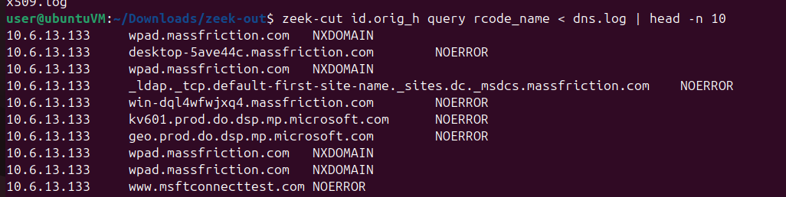
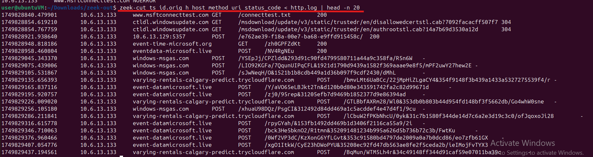
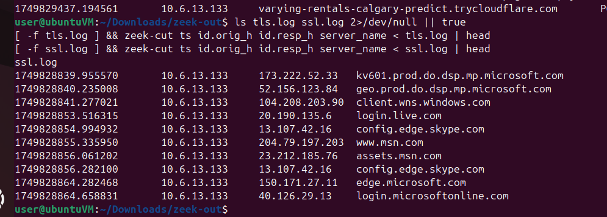

# Results — Zeek Lab

This document is the *completion* of the Zeek lab. It contains the actual commands you ran, the important output excerpts, and short, focused explanations.

>![IMPORTANT]
>
>Please check out [Zeek Lab](./zeek_lab.md) before visiting this section!

---

## Quick summary 

The pcap shows a host (10.6.13.133) performing normal Microsoft/Windows traffic **plus** repeated, automated HTTP POSTs and TLS connections whose hostnames match a small IOC list. A custom Zeek script raised a `Suspicious_Domain` notice for `www.truglomedspa.com`.

---

## 1) DNS — command and excerpt

**Command**

```bash
zeek-cut id.orig_h query rcode_name < dns.log | head -n 10
```

**Excerpt**

```
10.6.13.133	wpad.massfriction.com	NXDOMAIN
10.6.13.133	desktop-5ave44c.massfriction.com	NOERROR
10.6.13.133	wpad.massfriction.com	NXDOMAIN
10.6.13.133	_ldap._tcp.default-first-site-name._sites.dc._msdcs.massfriction.com	NOERROR
10.6.13.133	win-dql4wfwjxq4.massfriction.com	NOERROR
10.6.13.133	kv601.prod.do.dsp.mp.microsoft.com	NOERROR
10.6.13.133	geo.prod.do.dsp.mp.microsoft.com	NOERROR
10.6.13.133	wpad.massfriction.com	NXDOMAIN
10.6.13.133	wpad.massfriction.com	NXDOMAIN
10.6.13.133	www.msftconnecttest.com	NOERROR
```



**What this tells you:** shows recent queries from the victim. `NXDOMAIN` lines indicate failed lookups (wpad lookups can be noisy). Use counts (`awk|sort|uniq -c`) to surface anomalous names.

---

## 2) HTTP — command and excerpt

**Command**

```bash
zeek-cut ts id.orig_h host method uri status_code < http.log | head -n 20
```

**Excerpt (key lines)**

```
1749828840.479901	10.6.13.133	www.msftconnecttest.com	GET	/connecttest.txt	200
1749828921.938640	10.6.13.133	10.6.13.129:5357	POST	/e762ae39-f18a-00e7-ba68-e9ffd915458c/	200
1749828948.818186	10.6.13.133	event-time-microsoft.org	GET	/zh0GPFZdKt	200
1749828958.460804	10.6.13.133	eventdata-microsoft.live	POST	/NV4RgNEu	200
1749829045.343370	10.6.13.133	windows-msgas.com	POST	/YSEpJj/CPZldd&293d91c90fd4799580711a44a9c358fa/R5n6W	-
1749829135.656393	10.6.13.133	varying-rentals-calgary-predict.trycloudflare.com	POST	/bmvLMt6UaBCc/.../r	-
1749829165.837116	10.6.13.133	event-datamicrosoft.live	POST	/Y/aVO65eLBJkt2Tn&d120b0d80e343591742fa2c82d99671d	-
1749828885.381622	10.6.13.133	www.truglomedspa.com	POST	/....	-
```



**What this tells you:** Multiple repeated `POST` requests to uncommon domains — a classic indicator of automated C2/exfiltration. URIs are short/random-looking which strengthens the suspicion.


---

## 3) TLS/SSL SNI — command and excerpt

**Command**

```bash
ls tls.log ssl.log 2>/dev/null || true
[ -f tls.log ] && zeek-cut ts id.orig_h id.resp_h server_name < tls.log | head
[ -f ssl.log ] && zeek-cut ts id.orig_h id.resp_h server_name < ssl.log | head
```

**Excerpt (ssl.log)**

```
1749828839.955570	10.6.13.133	173.222.52.33	kv601.prod.do.dsp.mp.microsoft.com
1749828840.235008	10.6.13.133	52.156.123.84	geo.prod.do.dsp.mp.microsoft.com
1749828853.516315	10.6.13.133	20.190.135.6	login.live.com
1749828854.994932	10.6.13.133	13.107.42.16	config.edge.skype.com
1749828855.217789	10.6.13.133	23.198.7.186	www.bing.com
...
```



**Short takeaway:** Most SNI values are legitimate Microsoft/CDN hosts. SNI and HTTP host lists together help separate normal traffic from suspicious destinations.

---

## 4) notice.log excerpt

**Command**

```bash
cat notice.log
```

**Excerpt**

```
#fields ts uid id.orig_h id.orig_p id.resp_h id.resp_p ... note msg ...
1749828885.381622	Cx5lS2VDjxyGrtkK3	10.6.13.133	52469	205.174.24.80	443	...	Suspicious_Domain	tls to suspicious domain: www.truglomedspa.com	...
```

**What to do with this:** use the `uid` (`Cx5lS2VD...`) and the resp IP `205.174.24.80` as anchors to pivot into `conn.log`, `ssl.log`, and `http.log` to build a concise timeline and capture bytes/duration.

---


## 5) Recommended immediate actions:

- Mark `www.truglomedspa.com` and `205.174.24.80` as high-priority IOCs in the lab environment.
- If this were real: isolate the host, collect endpoint artifacts, and answer whether other internal hosts contact the same IP.

---

## Breakdown of `mal_domains.zeek` — tiny, clear, and accurate

Below the script is split into short chunks with a small explanation for each piece.

### 1) Load analyzers and frameworks

```zeek
@load base/protocols/http
@load base/protocols/ssl
@load base/frameworks/notice
```

**Explained:** brings in HTTP parsing, TLS/SSL parsing (SNI), and the Notice framework needed to emit `notice.log` entries.

---

### 2) Define a custom notice type

```zeek
redef enum Notice::Type += { Suspicious_Domain };
```

**Explained:** creates a human-friendly category (`Suspicious_Domain`) so notices are easy to filter and grade.

---

### 3) IOC set (constant)

```zeek
const Suspicious_Domains: set[string] = {
    "windows-msgas.com",
    "eventdata-microsoft.live",
    "event-datamicrosoft.live",
    "event-time-microsoft.org",
    "varying-rentals-calgary-predict.trycloudflare.com",
    "www.truglomedspa.com"
};
```

**Explained:** a static list of domains to match. Simple and explicit — good for teaching and grading.

---

### 4) Helper function: check a domain and optionally raise a notice

```zeek
function maybe_notice_domain(c: connection, domain: string, proto: string)
{
    # print(fmt("DBG: %s seen: %s  (from %s -> %s)", proto, domain, c$id$orig_h, c$id$resp_h));

    if ( domain in Suspicious_Domains )
    {
        NOTICE([
            $note = Suspicious_Domain,
            $msg  = fmt("%s to suspicious domain: %s", proto, domain),
            $conn = c,
            $identifier = fmt("%s/%s/%s", proto, domain, c$id$orig_h)
        ]);
    }
}
```

**Explained:**

- The `print()` line is optional debug (remove/comment for clean `notice.log`).
- If the domain is in the IOC set, the function emits a `NOTICE` with a message, connection context, and an identifier useful for correlation.

---

### 5) HTTP handler — check Host header

```zeek
event http_request(c: connection, method: string, original_URI: string, unescaped_URI: string, uri: string)
{
    if ( c?$http && c$http?$host )
        maybe_notice_domain(c, c$http$host, "http");
}
```

**Explained:** runs for each HTTP request; if a Host header exists it checks that host against the IOC set.

---

### 6) TLS SNI handler — check server\_name(s)

```zeek
event ssl_extension_server_name(c: connection, is_orig: bool, names: string_vec)
{
    if ( is_orig )
    {
        for ( i in names )
        {
            local sni = names[i];
            maybe_notice_domain(c, sni, "tls");
        }
    }
}
```

**Explained:** triggered when Zeek parses the SNI extension. We iterate all presented names (some clients supply multiple names) and check each against the IOC list.

---

## 7) How to run the script and what to expect

```bash
zeek -r ../lab_interlock.pcap mal_domains.zeek
cat notice.log
```

>[!TIP]
>
>**Expected:** `notice.log` will contain one or more `Suspicious_Domain` entries for matches. Use the `uid` from those entries to pivot into `conn.log`, `ssl.log`, and `http.log` for complete context.


---
[Back to the section](/courseFiles/Section_05-networkingAndTelemetry/networkingAndTelemetry.md)
