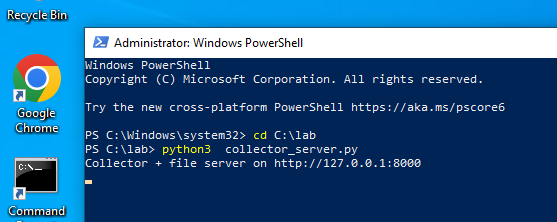
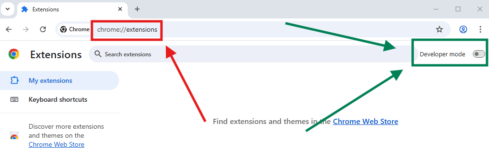
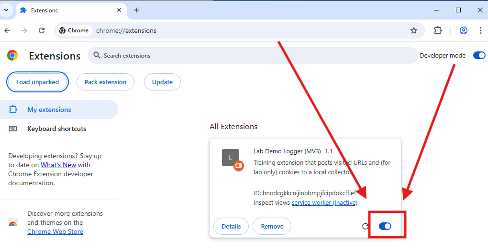
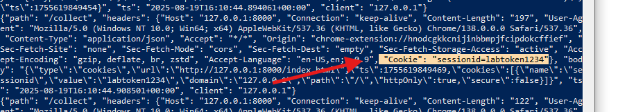

# Browser Malware Lab — Cookie Stealer + Extension Forensics 

>[!IMPORTANT]
>
>This document **does not** contain source code files. You will download the lab folder (ZIP) that includes all scripts and files. Below you will find the exact directory tree, a clear explanation of what each file does, and a step-by-step lab guide (how to run it, what to collect and how to detect).


*For documentation check out [browser_malware.md](./browser_malware.md)*
---

## Lab purpose

This lab is a focused, hands-on exercise that teaches you how browser-based threats work and how to investigate them.

>[!IMPORTANT]
>
>All traffic is localhost-only (127.0.0.1). You must download [this prepared folder](./browser_malware_lab_files.zip) and place it at `C:\`. //unzipped, of course!

---

## Lab directory tree 

```
C:\lab\
├─ extension_unpacked\
│  ├─ manifest.json    
│  └─ background.js     
├─ webroot\
│  ├─ index.html 
│  ├─ collector_log.jsonl         
│  └─ obf1.js             
├─ collector_server.py      
```

>[!WARNING]
>
>filenames and paths must match exactly. Lab steps below assume `C:\lab\` as the working folder.

---

## What each file does?

### `extension_unpacked/manifest.json`

- **Role:** Declares extension identity, MV3 service worker, and requested permissions (ex: `cookies`, `tabs`, `host_permissions`).
- **Why SOC cares:** Permissions indicate what the extension *can* access. `cookies` + broad host permissions = ability to read HttpOnly cookies across sites — a high-risk capability.

---

### `extension_unpacked/background.js`

- **Role:** MV3 service worker that runs when events (tabs.onUpdated) happen. It performs two actions in the lab:
  1. Posts a `visit` JSON to the collector for each completed tab load.
  2. Calls `chrome.cookies.getAll({url})` to read cookies for the visited site and posts a `cookies` JSON to the collector.
- **Why SOC cares:** This file shows the exact exfiltration mechanism. In production you’d search for such API calls and for hardcoded endpoints.
>[!TIP]
>
> Save this file as evidence; extract function names, endpoints, and timing logic.

---

### `webroot/index.html`

- **Role:** A simple login page and demonstration page. Submitting the form triggers `/login` on the collector server, which returns `Set-Cookie: sessionid=labtoken1234; HttpOnly`.
- **Why SOC cares:** It demonstrates the difference between page scripts (cannot access HttpOnly cookies) and privileged extensions (can, if permitted).
>[!TIP]
>
>Use the page to reproduce the exact sequence (login → cookie issuance → extension cookie POST).

---

### `webroot/obf1.js`

- **Role:** Intentionally obfuscated JavaScript using `atob`, `fromCharCode`, and `eval`. It stores a token in `localStorage` and logs to the console.


---

### `collector_server.py`

- **Role:** Serves files, handles `/login` POST (sets the HttpOnly cookie) and writes any `/collect` POSTs into `collector_log.jsonl` (one JSON object per line).
- **Why SOC cares:** `collector_log.jsonl` simulates attacker C2/proxy logs and is the primary evidence source for exfiltrated data.

>[!TIP]
>
>Treat any `cookies` payloads in `collector_log.jsonl` as high-priority IOCs.

---


## Lab — step-by-step instructions 


### Pre-conditions

- Lab folder extracted to `C:\`. // it must be C:\lab\ after extraction
- Chrome/Chromium installed.
- Python 3.8+ 


### Step 1 — Start the collector/file server 

1. Open PowerShell (or a terminal) and run:
   ```powershell
   cd C:\lab
   python3  collector_server.py
   ```
2. Leave this terminal open for server logs. You should see a line like: `Collector + file server on http://127.0.0.1:8000`.



**What to observe:** the server will print `Served index.html` when requested and `Captured POST to /collect` for extension POSTs.

### Step 2 — Load the unpacked extension into Chrome

1. Open Chrome and go to `chrome://extensions/`.

2. Enable **Developer mode** (top-right).



3. Click **Load unpacked** and select `C:\lab\extension_unpacked`. // !! You must select the folder, not a file!


4. Ensure the extension is **Enabled** in the list.




### Step 3 — Generate baseline events (visit the page)

1. In Chrome navigate to: `http://127.0.0.1:8000/index.html`.
2. Check the server terminal — it should show `GET /index.html` and `GET /obf1.js` served. Check `collector_log.jsonl` for a `visit` entry: the extension posts a `visit` payload on completed loads.

**Why this matters:** visit payloads help correlate user browsing with exfil events.

### Step 4 — Perform the login (issue the HttpOnly cookie)

1. Submit the login form on the page (use the provided default credentials).
2. The server will process `/login`, set `Set-Cookie: sessionid=labtoken1234; HttpOnly`, and log the event in `collector_log.jsonl`.
3. Verify in the server terminal the `/login` handling message appears.

>[!IMPORTANT]
>
>**Forensic note:** HttpOnly prevents page JS from reading the cookie — privileged extensions with `cookies` permission can read it.

### Step 5 — Confirm cookie exfiltration

1. After login, the extension service worker should detect the navigation and call `chrome.cookies.getAll({url})` for the page.
2. The extension will POST a `cookies` payload to `/collect` containing cookie details and values.
3. Verify by reading the collector log:
   ```powershell
   Get-Content C:\lab\webroot\collector_log.jsonl -Tail 50
   Select-String -Path C:\lab\webroot\collector_log.jsonl -Pattern '"type"\s*:\s*"cookies"' -SimpleMatch
   ```

**Expected evidence:** JSON lines in `collector_log.jsonl` that include `"type":"cookies"` and the stolen `sessionid` value (ex: `labtoken1234`).



### Detection ideas & sample pseudo-rules 

Below are practical detection approaches you can convert into SIEM, IDS, or EDR rules.

**1) YARA-like for saved JS files**

```yara
rule Suspicious_Obfuscated_JS {
  strings:
    $eval = "eval(" ascii
    $fromChar = "fromCharCode(" ascii
    $atob = "atob(" ascii
  condition:
    any of them
}
```

*Use case:* scan saved JS artifacts or a web cache of responses.

**2) Suricata-like HTTP detection**

```
alert http any any -> any any (msg:"JS obfuscation in HTTP response"; content:"eval("; nocase; http_client_body; pcre:"/fromCharCode\s*\(/i"; sid:1000001; rev:1;)
```

*Use case:* inspect HTTP response bodies on a perimeter IDS if full body capture is enabled.


**3) Behavioral hunt: browser → frequent small POSTs**

```
index=network method=POST dest_host!=internal_corp_hosts
| stats count, avg(bytes) by src_ip, dest_host
| where count > 5 AND avg(bytes) < 2000
```

*Use case:* detect beaconing/exfil patterns from browsers; tune `count` and `bytes` to reduce false positives.


### Incident response checklist (just quick reference)

- **Triage**: identify affected users & hosts, capture scope and initial vector (extension install, phishing, etc.).
- **Collect**: memory, extension files, `collector_log.jsonl`, history DB, endpoint logs, DNS logs, and proxy logs.
- **Contain**: disable extension, block destination, isolate host if needed.
- **Eradicate**: remove extensions, rotate credentials, patch any exploited components.
- **Recover**: restore services, monitor for reoccurrence, and reintroduce users with stricter controls.


### Examples:


**Example cookie entry:**

```json
{"path":"/collect","headers":{...},"body":"{\"type\":\"cookies\",\"url\":\"http://127.0.0.1:8000/login\",\"ts\":1755613920570,\"cookies\":[{\"name\":\"sessionid\",\"value\":\"labtoken1234\",\"domain\":\"127.0.0.1\",\"path\":\"/\",\"httpOnly\":true,\"secure\":false}]}","ts":"2025-08-19T14:32:50.248318+00:00","client":"127.0.0.1"}
```

**Example timeline:**

- 2025-08-19T14:31:13Z — GET /index.html served
- 2025-08-19T14:31:13Z — Extension POST /collect (type=visit)
- 2025-08-19T14:32:00Z — POST /login processed, Set-Cookie=sessionid=labtoken1234
- 2025-08-19T14:32:50Z — Extension POST /collect (type=cookies) with sessionid=labtoken1234


---
[Back to the section](/courseFiles/Section_06-webSecurity/webSecurity.md)