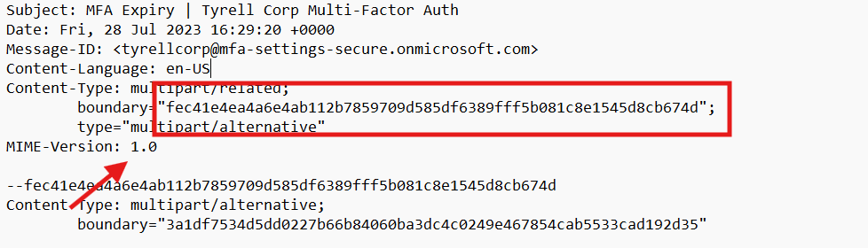

# CTF Challenge – Email Analysis 06

**File:** [email06.eml](./email06.eml)\
**Category:** MIME Structure / Inline Image Forensics / HTML Rendering

## Questions


1. **Multipart Boundary**\
   What boundary string is used in the top-level `Content-Type: multipart/related;` header?\
   *Answer format:* boundary text without quotes

2. **Image MIME Type**\
   What MIME type is declared for the inline image part?\
   *Answer format:* MIME type

3. **Filename of Inline Image**\
   What filename is given to the inline image in its `Content-Disposition` header?\
   *Answer format:* filename with extension


4. **HTML-Specified Dimensions**\
   According to the HTML body, what are the width and height (in pixels) of the embedded image?\
   *Answer format:* width × height (e.g., `100 × 200`)

5. **Attachment Size**\
   What is the size (in bytes) declared for the inline image in its header?\
   *Answer format:* integer bytes

---

## Writeup and Solutions

### Q1: Multipart Boundary

- **Where to look:** The `Content-Type: multipart/related` header near the top.
- **Excerpt:**
  ```text
  Content-Type: multipart/related;
    boundary="fec41e4ea4a6e4ab112b7859709d585df6389fff5b081c8e1545d8cb674d";
  ```
- **Answer:**
  ```
  fec41e4ea4a6e4ab112b7859709d585df6389fff5b081c8e1545d8cb674d
  ```



### Q2: Image MIME Type

- **Where to look:** The `Content-Type` header of the image part.  
- **Excerpt:**  
```text
Content-Type: image/jpeg; name="refresh.png"

```
- **Answer:**
  ```
  image/jpeg
  ```


### Q3: Filename of Inline Image

- **Where to look:** The `Content-Disposition` header of the image part.  
- **Excerpt:**  
```text
Content-Disposition: inline; filename="refresh.png"; size=69268;
````

- **Answer:**
```
  refresh.png
```


### Q4: HTML-Specified Dimensions

- **Where to look:** The HTML `` tag attributes.  
- **Excerpt:**  
```html

````

- **Answer:**
```
736 × 875
```


### Q5: Attachment Size

- **Where to look:** The image part’s `Content-Disposition` header.  
- **Excerpt:**  
```text
Content-Disposition: inline; filename="refresh.png"; size=69268;
````

- **Answer:**
```
69268
```


