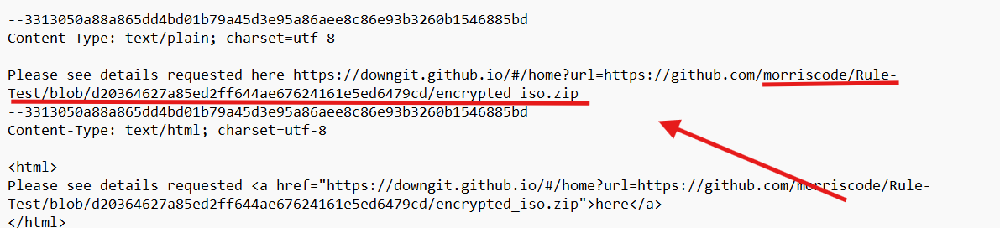

# CTF Challenge – Email Analysis 04

**File:** [email04.eml](./email04.eml)\
**Category:** Encrypted Attachment Download / URL Forensics / Header Authentication

## Questions


1. **SPF Client-IP**\
   Which IP address did Google record as the client in the `Received-SPF` header?\
   *Answer format:* IPv4 address

2. **Outbound Hostname**\
   What is the hostname of the server that delivered the mail to Google?\
   *Answer format:* full hostname


3. **Download Link Host**\
   The plain-text part includes a URL. Extract the host component of that URL.\
   *Answer format:* hostname only

4. **GitHub Raw Path**\
   From the same URL, identify the path on GitHub that points to the `encrypted_iso.zip` file.\
   *Answer format:* full GitHub path


5. **MIME Boundary String**\
   What boundary string is used in the `Content-Type: multipart/alternative; boundary=...` header?\
   *Answer format:* boundary text without quotes

6. **ARC Authentication-Results SPF Domain**\
   In the `ARC-Authentication-Results` header, what domain is tested under SPF?\
   *Answer format:* domain name

---

## Writeup and Solutions

### Q1: SPF Client-IP

- **Where to look:** The `Received-SPF` header.
- **Excerpt:**
  ```
  Received-SPF: pass (... designates 40.107.236.41 as permitted sender)
  ```
- **Answer:**
  ```
  40.107.236.41
  ```


### Q2: Outbound Hostname

- **Where to look:** The first `Received:` header (topmost).
- **Excerpt:**
  ```
  Received: from NAM11-BN8-obe.outbound.protection.outlook.com (mail-bn8nam11on2041.outbound.protection.outlook.com. [40.107.236.41])
  ```
- **Answer:**
  ```
  NAM11-BN8-obe.outbound.protection.outlook.com
  ```


### Q3: Download Link Host

- **Where to look:** Plain-text body.
- **Excerpt:**
  ```
  https://downgit.github.io/#/home?url=https://github.com/morriscode/Rule-Test/blob/d20364627a85ed2ff644ae67624161e5ed6479cd/encrypted_iso.zip
  ```
- **Answer:**
  ```
  downgit.github.io
  ```


### Q4: GitHub Raw Path

- **Where to look:** The query parameter after `url=`.
- **URL:**
  ```
  https://github.com/morriscode/Rule-Test/blob/d20364627a85ed2ff644ae67624161e5ed6479cd/encrypted_iso.zip
  ```
- **Answer:**
  ```
  /morriscode/Rule-Test/blob/d20364627a85ed2ff644ae67624161e5ed6479cd/encrypted_iso.zip
  ```




### Q5: MIME Boundary String

- **Where to look:** The `Content-Type` header.
- **Excerpt:**
  ```
  Content-Type: multipart/alternative; boundary=3313050a88a865dd4bd01b79a45d3e95a86aee8c86e93b3260b1546885bd
  ```
- **Answer:**
  ```
  3313050a88a865dd4bd01b79a45d3e95a86aee8c86e93b3260b1546885bd
  ```


### Q6: ARC Authentication-Results SPF Domain

- **Where to look:** The `ARC-Authentication-Results` header.
- **Excerpt:**
  ```
  arc=pass (i=1 spf=pass spfdomain=ennuiconsultingcom.onmicrosoft.com ...)
  ```
- **Answer:**
  ```
  ennuiconsultingcom.onmicrosoft.com
  ```


