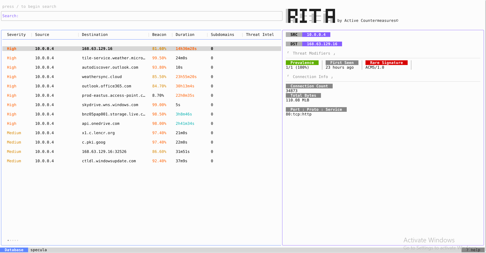

**RITA** stands for **Real Intelligence Threat Analytics**—an open-source framework that helps SOC analysts detect stealthy Command-and-Control (C2) behavior through network traffic patterns, it works by analyzing Zeek logs (TSV or JSON) or PCAPs converted into Zeek format, focusing on anomalies rather than signature-based detection

Rather than relying solely on known IoCs, RITA equips analysts to hunt signals like beaconing, DNS tunneling, and long-lived connections—subtle signs of compromise that often slip past traditional defenses

[Official Rita Github Repository](https://github.com/activecm/rita)

# Setup
- Go to the latest release of **Rita** [here](https://github.com/activecm/rita/releases) and get the compressed installer, at my time it is ``rita-v5.0.8.tar.gz``, the version will change eventually
- Uncompress the installer
```bash
tar -xf rita-v5.0.8.tar.gz
```
- **Cd** into it
```bash
cd rita-v5.0.8-installer/
```
- Run the install script
```bash
./install_rita.sh localhost
```
- Test it
```bash
rita h
```

# Why RITA Matters for SOC Teams
- **Behavior‑driven hunting:** Unlike static detection rules, RITA surfaces patterns—like regular heartbeats or long-standing sessions—that indicate potential C2 even from unknown malware
- **Accelerated triage:** The latest version consolidates all threat types into one interface—no more juggling ``show-beacons``, ``show-long-connections``, etc, everything’s visible in one streamlined view
- **Scalable & fast:** RITA 5 uses ClickHouse instead of MongoDB, offering 2× to over 20× faster data ingestion and analysis—capable of handling networks pushing ~100 Gbps

# Usage

```bash
rita view datasetname
```


## Importing & analyzing data

### From PCAP(s)

1. If you have multiple PCAPs, merge them first:

```bash
mergecap -w outfilename.pcap infilename1.pcap infilename2.pcap
```

2. Generate Zeek logs from a PCAP (example with daily log rotation):

```bash
zeek -r filename.pcap local "Log::default_rotation_interval = 1 day"
```

This will produce Zeek logs (conn.log, dns.log, http.log, user\_agent.log, etc.) which RITA consumes.

### Importing Zeek logs into RITA

- One-off import (single import of a directory of Zeek logs):

```bash
rita -l import /path/to/your/zeek_logs datasetname
```


> Default Zeek logs directory (common location on systems running Zeek):
>
> `/opt/zeek/logs/<date>`

---

## Examining data (commands & outputs)

RITA provides a set of commands to surface suspicious behaviours. Replace `datasetname` with the name you used when importing.

### List available datasets

```bash
rita list
```


## View  dataset report

```bash
rita view <datasetname>
```
This command will open a menu that should look similar to the one below:



>[!IMPORTANT]
>
>Most of the previous commands used in RITA v4 were replaced by this command and this menu.

- For navigation help press:

```
?
```


>[!TIP]
>
> For search help press `/`. after that press `?`.


---
[Back to the section](/courseFiles/Section_05-networkingAndTelemetry/networkingAndTelemetry.md)
